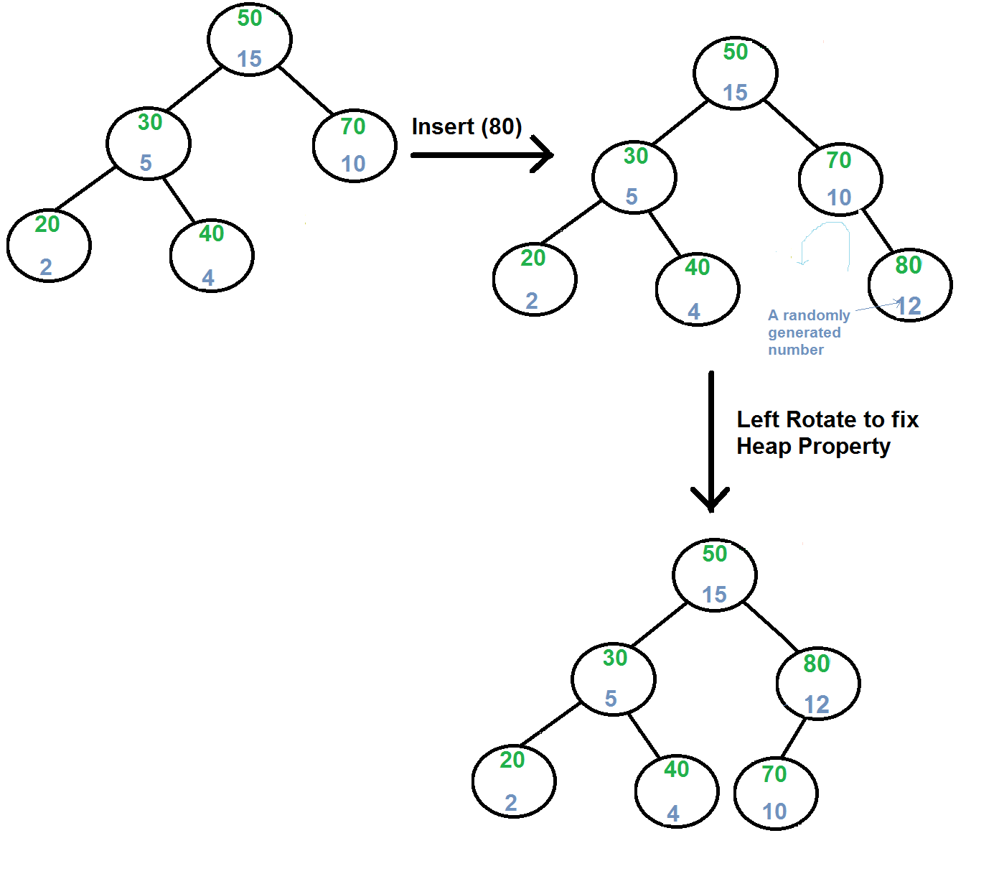

# Декартово дерево

---

**Дополнительное задание**: написать программу, реализующую построение декартова дерева.

---

### Требования:
- Программа должна демонстрировать все возможные действия (вставка, удаление, поиск).
  - Все функции должны иметь оптимальную сложность по времени и по памяти (**O(logn)**).
- Построенная структура данных должна удовлетворять свойству кучи.
- Программа должна следовать **код-стилю от Google**.
- Программа должна быть отлажена с помощью **clang-tidy**.
- Программа должна быть сформатирован с помощью **clang-format**.
- Программа должна исправляться в соответствии с код-ревью от [@hyperb0rean](https://github.com/hyperb0rean).
---
### Результат:
```
Построенная дуча:

1(52)
2(66)
3(30)
4(22)
6(12)
7(63)
8(74)
9(11)
10(29)

Добавление узла 5:

1(52)
2(66)
3(30)
4(22)
5(6)
6(12)
7(63)
8(74)
9(11)
10(29)

Удаление узла 8:

1(52)
2(66)
3(30)
4(22)
5(6)
6(12)
7(63)
9(11)
10(29)

Удаление узла 3:

1(52)
2(66)
4(22)
5(6)
6(12)
7(63)
9(11)
10(29)

Поиск всех узлов с 1 до 10:

1: есть
2: есть
3: нет
4: есть
5: есть
6: есть
7: есть
8: нет
9: есть
10: есть

Process finished with exit code 0
```
