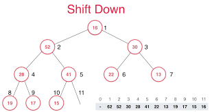

# Кучирование

---

**Дополнительное задание**: написать программу, преобразующий линейную структуру данных (здесь вектор) в кучу.

---

### Требования:
- Функция должна принять 2 итератора в качестве аргумента.
    - Сама функция `heapify()` тоже должна принять 2 итератора.
- Построенная куча должна удовлетворять **свойству кучи**.
- Результат функции должен сравниваться с библиотечной функцией **std::make_heap()**.
- Код программы должен следовать **код-стилю от Google**.
- Код программы должен быть отлажен с помощью **clang-tidy**.
- Код программы должен быть сформатирован с помощью **clang-format**.
- Код программы должен исправляться в соответствии с код-ревью от [@hyperb0rean](https://github.com/hyperb0rean).
---
### Результат:
```
Vector to heap (custom-made):
17 15 13 9 6 5 10 4 8 3 1
Vector to heap (make_heap):
17 15 13 9 6 5 10 4 8 3 1
Process finished with exit code 0
```